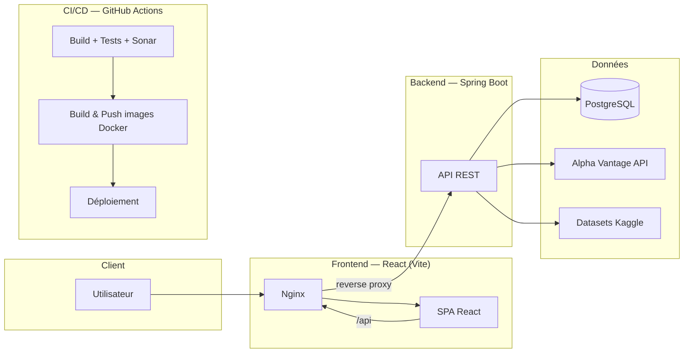

<div align="center">

# AlphaRoom

### Simulateur de Salle de Marché

*Projet de Fin d'Études — ESPRIT — Équipe PIF*

[](https://openjdk.org/)
[](https://spring.io/projects/spring-boot)
[](https://maven.apache.org/)
[](https://react.dev/)
[](https://vitejs.dev/)
[](https://www.postgresql.org/)
[](https://www.docker.com/)
[](https://github.com/features/actions)
[](https://sonarcloud.io/)
[](https://nginx.org/)

</div>

---

## Sommaire

- [À propos du projet](#à-propos-du-projet)
- [Équipe](#équipe)
- [Modules fonctionnels](#modules-fonctionnels)
- [Actifs couverts](#actifs-couverts)
- [Architecture](#architecture)
- [Stack technique](#stack-technique)
- [Structure du dépôt](#structure-du-dépôt)
- [Démarrage rapide](#démarrage-rapide)
- [Docker & PostgreSQL](#docker--postgresql)
- [Workflow Git & scripts](#workflow-git--scripts)
- [Pipeline CI/CD](#pipeline-cicd)
- [Gouvernance & sécurité](#gouvernance--sécurité)

---

## À propos du projet

**AlphaRoom** est un simulateur de salle de marché développé dans le cadre du Projet à l'**ESPRIT** (École Supérieure Privée d'Ingénierie
et de Technologies).

Une salle de marché (*trading room*) est l'environnement dans lequel une banque ou une
institution financière réalise, suit et contrôle des opérations sur les marchés financiers.
Elle regroupe des métiers qui travaillent ensemble : **Trader** (exécute les opérations et
gère les positions), **Sales** (interagit avec les clients), **Risk Manager** (surveille les
risques et les limites), **Analyste** (analyse marchés et actualités) et **IT/Admin** (gère
la plateforme, les utilisateurs, les marchés et les scénarios).

AlphaRoom reproduit cet environnement sous forme d'un simulateur interactif et pédagogique,
permettant aux utilisateurs — nouveaux traders comme professionnels — de s'exercer au
trading, à la gestion de portefeuille et à l'évaluation des risques, tout en s'appuyant sur
l'intelligence artificielle pour la prédiction, l'aide à la décision et l'explicabilité (XAI).

Le nom **AlphaRoom** fait référence à l'*alpha*, la surperformance qu'un trader ou un modèle
cherche à générer, combiné à la *room* (salle de marché) — et fait aussi un clin d'œil à
**Alpha Vantage**, l'une des sources de données de marché utilisées par le projet.

## Équipe

Projet réalisé par l'**Équipe PIF** :

| Membre |
|---|
| Nadhmi Rouissi |
| Haroun Chebaane |
| Youssef Mellouli |
| Safwen Haboubi |
| Chahine Saadellaoui |
| Ghassen Hamdi |

## Modules fonctionnels

Le cahier des charges est découpé en 6 modules, chacun rattaché à un besoin métier explicite :

| # | Module | Description | Réf. cahier des charges |
|---|---|---|---|
| 1 | **Marché & Exécution** | Environnement de marché, cotations, ordres (Buy/Sell, Market/Limit/Stop) | §3.1, §3.2 |
| 2 | **Portefeuille & Risque** | Cash, positions, exposition, limites, alertes, Stop Loss / Take Profit | §3.2 |
| 3 | **Analyse Financière & Backtesting** | Indicateurs techniques, graphiques, validation de stratégies sur historique | §3.2 |
| 4 | **Formation / Pédagogie / Gamification** | Mode progressif, challenges, scores, badges, coach de performance | §3.3 |
| 5 | **IA Marché & Agent de Trading** | Prédiction de prix, agent IA de trading, explications en langage simple | §3.4, §3.6 |
| 6 | **Risk Intelligence** | Stress Testing bancaire (conventionnel + islamique) & Actuariat | §3.5, §3.7 |

La **Sécurité** (§4) et l'**Administration** (§5) sont traitées comme des préoccupations
transverses à l'ensemble des modules plutôt que comme un module dédié.

## Actifs couverts

Pour garder un périmètre réaliste tout en couvrant plusieurs classes d'actifs citées dans
le cahier des charges (*actions, obligations, matières premières et devises*), AlphaRoom
s'appuie sur un panier restreint :

| Classe | Actif | Justification |
|---|---|---|
| Matière première | **Or (XAU/USD)** | Actif pivot : réserve de valeur bancaire, actif de référence en finance islamique (Mourabaha/Ijara/Sukuk, AAOIFI n°57), actif de couverture en assurance/Takaful |
| Matière première | **Argent (XAG/USD)** | Même source de données que l'or (Alpha Vantage), également un bien *Ribawi* en finance islamique |
| Matière première | **Pétrole (WTI/Brent)** | Choc macroéconomique classique pour les scénarios de stress testing |
| Devise | **EUR/USD** | Paire de référence, directement liée aux scénarios de hausse des taux d'intérêt |
| Action | **S&P 500** | Représente le risque marché actions dans les scénarios de stress testing |

## Architecture



Le frontend React est servi par Nginx, qui fait aussi office de reverse proxy vers l'API
Spring Boot (`/api/*`). Le backend expose les données de marché, la logique de portefeuille
et de risque, et consomme Alpha Vantage (temps quasi réel) et les datasets Kaggle
(historique pour le backtesting et l'entraînement IA). PostgreSQL persiste les comptes,
portefeuilles, positions et résultats de simulation. L'ensemble est containerisé et déployé
via un pipeline GitHub Actions (build, tests, analyse Sonar, images Docker, déploiement).

## Stack technique

| Couche | Technologies |
|---|---|
| Backend | Java 21, Spring Boot 3.3, Spring Data JPA, Maven |
| Frontend | React 18, Vite, ESLint, Vitest + Testing Library |
| Base de données | PostgreSQL 16 |
| Conteneurisation | Docker (multi-stage), Docker Compose |
| Serveur web / reverse proxy | Nginx |
| CI/CD | GitHub Actions |
| Qualité de code | SonarCloud (SonarQube), JaCoCo (couverture backend), lcov (couverture frontend) |
| Registre d'images | GitHub Container Registry (GHCR) |
| Sources de données marché | Alpha Vantage API, datasets Kaggle (historique XAU/USD, actifs corrélés) |

## Structure du dépôt

```
AlphaRoom/
├── .github/
│   └── workflows/
│       └── ci.yml              # Pipeline CI/CD (build, tests, Sonar, Docker, deploy)
├── backend/                    # API Spring Boot (Java 21, Maven)
│   ├── src/main/java/...       # Code applicatif
│   ├── src/test/java/...       # Tests unitaires/intégration
│   ├── pom.xml
│   └── Dockerfile
├── frontend/                   # Application React (Vite)
│   ├── src/
│   ├── package.json
│   ├── Dockerfile
│   ├── nginx.conf
│   └── sonar-project.properties
├── docker-compose.yml          # Environnement local : db + backend + frontend
├── new-push.sh / new-push.bat  # Crée une branche, commit initial, push
├── update.sh / update.bat      # Bascule sur main et récupère les derniers changements
└── README.md
```

## Démarrage rapide

**Prérequis :** Docker Desktop installé et lancé.

```bash
git clone https://github.com/nadhmi54/AlphaRoom.git
cd AlphaRoom
docker compose up --build
```

- Frontend : http://localhost:8081
- Backend (health check) : http://localhost:8080/api/health
- PostgreSQL : localhost:5433

## Docker & PostgreSQL

Le projet utilise **Docker Compose** pour orchestrer trois services : `db` (PostgreSQL),
`backend` (Spring Boot) et `frontend` (React servi par Nginx).

### Lancer l'environnement complet

```bash
docker compose up --build
```

Ajoute `-d` pour lancer en arrière-plan :

```bash
docker compose up --build -d
```

### Commandes utiles

```bash
# Voir l'état des conteneurs
docker compose ps

# Suivre les logs (tous les services, ou un seul)
docker compose logs -f
docker compose logs -f backend

# Arrêter les conteneurs (sans supprimer les données)
docker compose stop

# Arrêter et supprimer les conteneurs (le volume de données Postgres est conservé)
docker compose down

# Arrêter, supprimer les conteneurs ET les données Postgres (reset complet)
docker compose down -v

# Reconstruire une image après modification du code
docker compose build backend
docker compose build frontend
```

### Se connecter directement à PostgreSQL

```bash
docker compose exec db psql -U alpharoom -d alpharoom
```

Identifiants par défaut (définis dans `docker-compose.yml`, à ne jamais utiliser tels
quels en production) :

| Variable | Valeur locale |
|---|---|
| `POSTGRES_DB` | `alpharoom` |
| `POSTGRES_USER` | `alpharoom` |
| `POSTGRES_PASSWORD` | `alpharoom` |
| Port exposé | `5433` (redirigé vers `5432` dans le conteneur) |

Pour s'y connecter depuis un client externe (DBeaver, pgAdmin, IntelliJ...) : hôte
`localhost`, port `5433`, base `alpharoom`.

### Relancer le backend seul après une modification

```bash
docker compose up --build backend
```

## Workflow Git & scripts

Le dépôt fournit deux paires de scripts (`.sh` pour Git Bash/Linux/Mac, `.bat` pour
PowerShell/CMD) qui automatisent le flux de travail Git de l'équipe.

### `new-push` — démarrer une nouvelle fonctionnalité

À utiliser **une seule fois par nouvelle branche/fonctionnalité**. Le script crée la
branche, fait un commit initial et la pousse sur `origin`.

```powershell
.\new-push.bat
```
```bash
./new-push.sh
```

Il te demande un nom de branche, par exemple `feature-module-marche`, puis exécute
l'équivalent de :

```bash
git checkout -b feature-module-marche
git add .
git commit -m "Initial commit on feature-module-marche"
git push origin feature-module-marche
```

Une fois la branche poussée, ouvre une **Pull Request** sur GitHub vers `main`. Elle devra
passer la review (1 approbation minimum) et les checks CI (build + tests + Sonar) avant de
pouvoir être mergée, conformément à la règle de protection configurée sur `main`.

> ⚠️ Ce script crée une **nouvelle** branche à chaque exécution. Pour ajouter d'autres
> commits sur une branche déjà existante, utilise directement :
> ```bash
> git add .
> git commit -m "message"
> git push origin nom-de-la-branche
> ```

### `update` — synchroniser son `main` local

À lancer après qu'une Pull Request a été mergée sur GitHub, pour récupérer les derniers
changements avant de démarrer une nouvelle branche.

```powershell
.\update.bat
```
```bash
./update.sh
```

Équivalent de :

```bash
git switch main
git pull origin main
```

### Flux de travail recommandé

1. `.\update.bat` → s'assurer que `main` est à jour.
2. `.\new-push.bat` → créer une branche pour la fonctionnalité à développer.
3. Développer, commiter au fil de l'eau (`git add` / `git commit` / `git push`).
4. Ouvrir une Pull Request vers `main` sur GitHub.
5. Attendre la review + les checks CI/CD verts, puis merger.
6. `.\update.bat` → resynchroniser `main` avant la prochaine fonctionnalité.

## Pipeline CI/CD

Le fichier `.github/workflows/ci.yml` définit 4 jobs, déclenchés sur chaque `push` et
`pull_request` vers `main` ou `develop` :

| Job | Rôle |
|---|---|
| `backend` | Build Maven, tests JUnit avec une base Postgres de service, couverture JaCoCo, analyse SonarCloud |
| `frontend` | Lint ESLint, tests Vitest avec couverture, build Vite, analyse SonarCloud |
| `docker` | Build et push des images backend/frontend vers GHCR (uniquement sur push vers `main`, après succès des jobs précédents) |
| `deploy` | Déploiement SSH + `docker compose` vers l'environnement de production (déclenchement manuel, protégé par un environnement GitHub avec approbation) |

## Gouvernance & sécurité

- **Branch protection** sur `main` : Pull Request obligatoire (1 approbation minimum),
  résolution des conversations requise, status checks CI obligatoires, force-push et
  suppression de branche bloqués.
- Les administrateurs du dépôt peuvent contourner la review (utile en solo ou en cas
  d'urgence), mais le flux normal passe par une Pull Request.
- Les secrets sensibles (identifiants base de données, `SONAR_TOKEN`, clés de déploiement)
  sont stockés dans **GitHub Secrets**, jamais commités dans le code.
